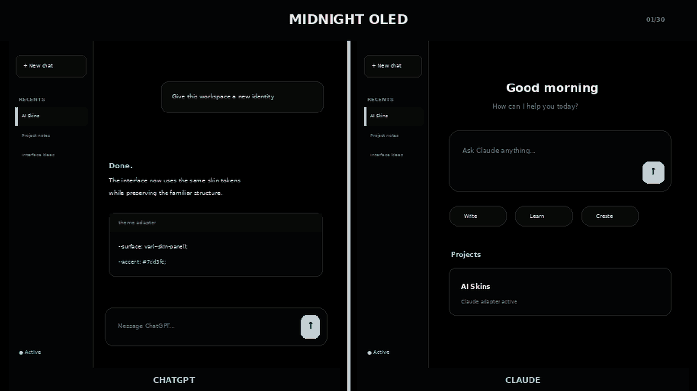
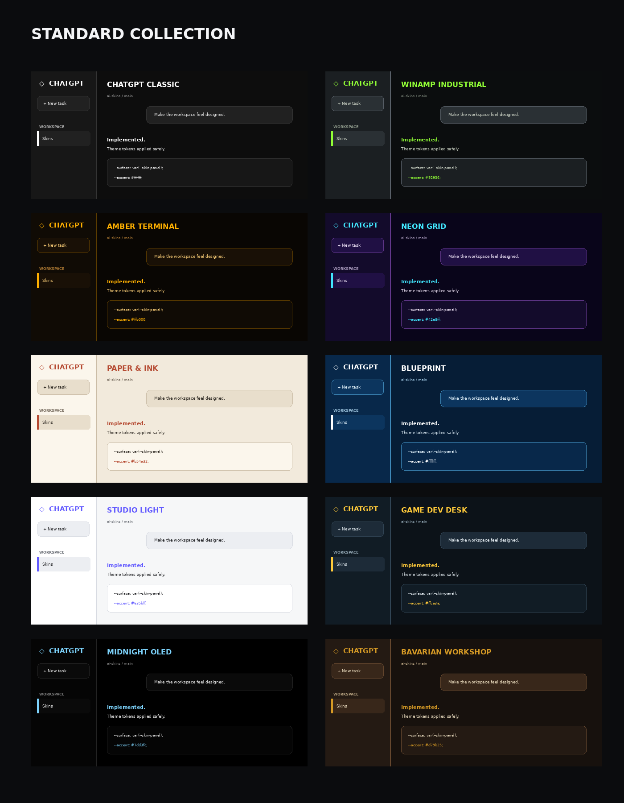
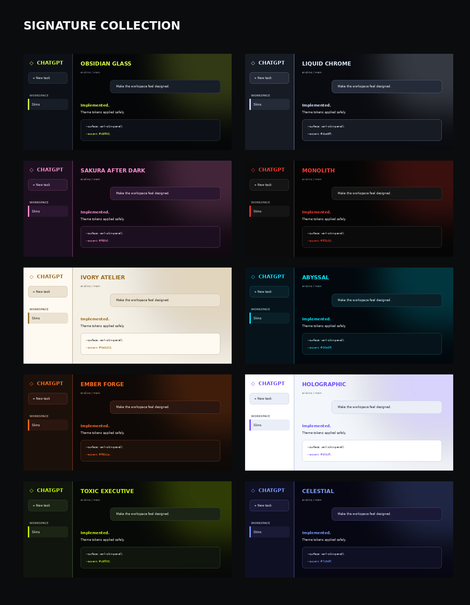
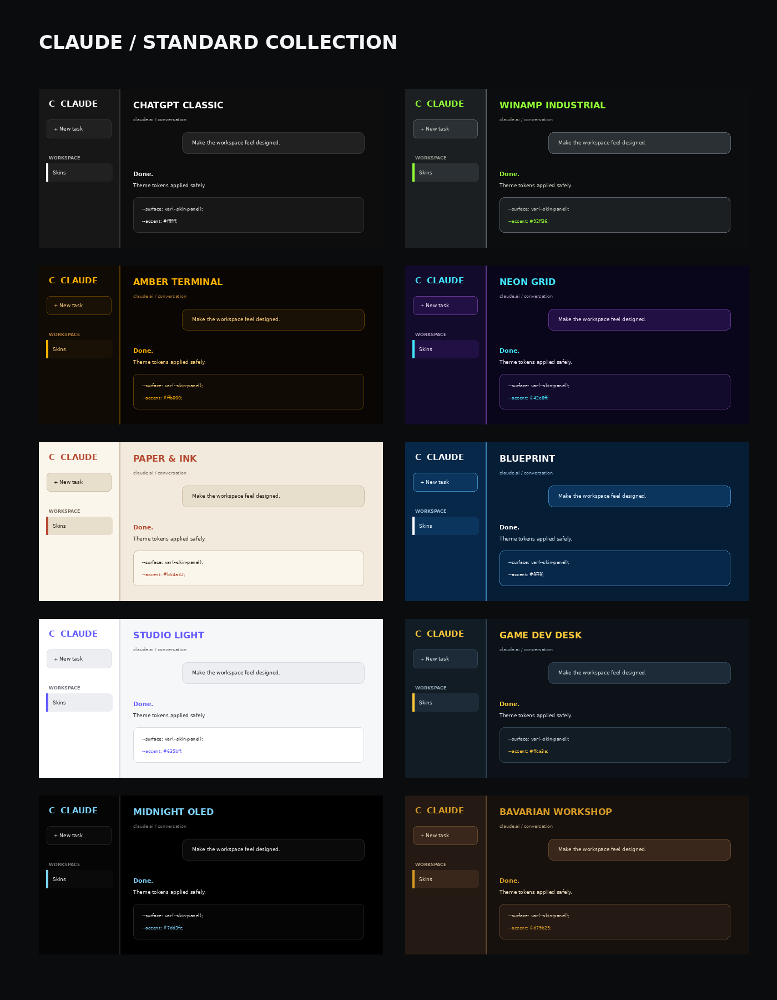
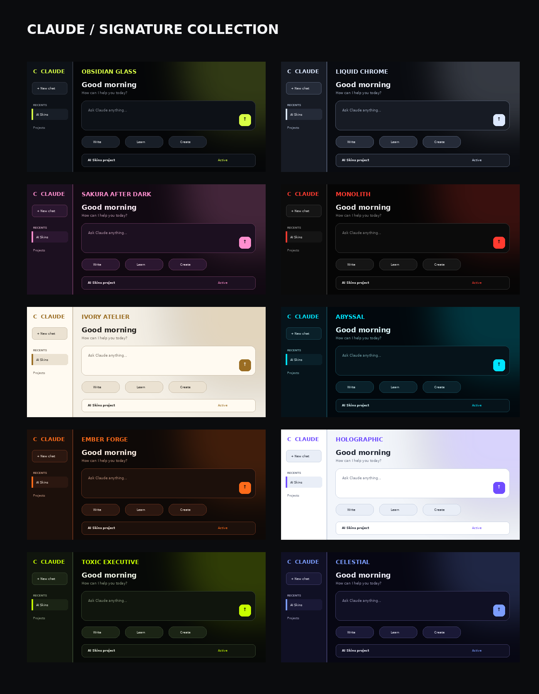
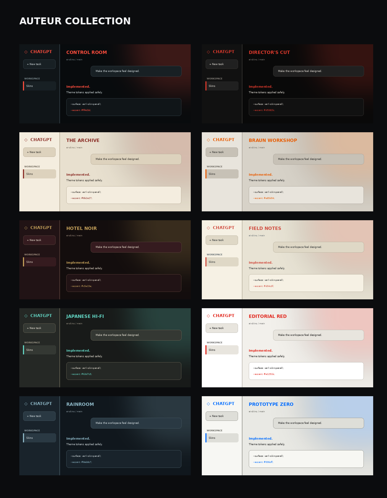
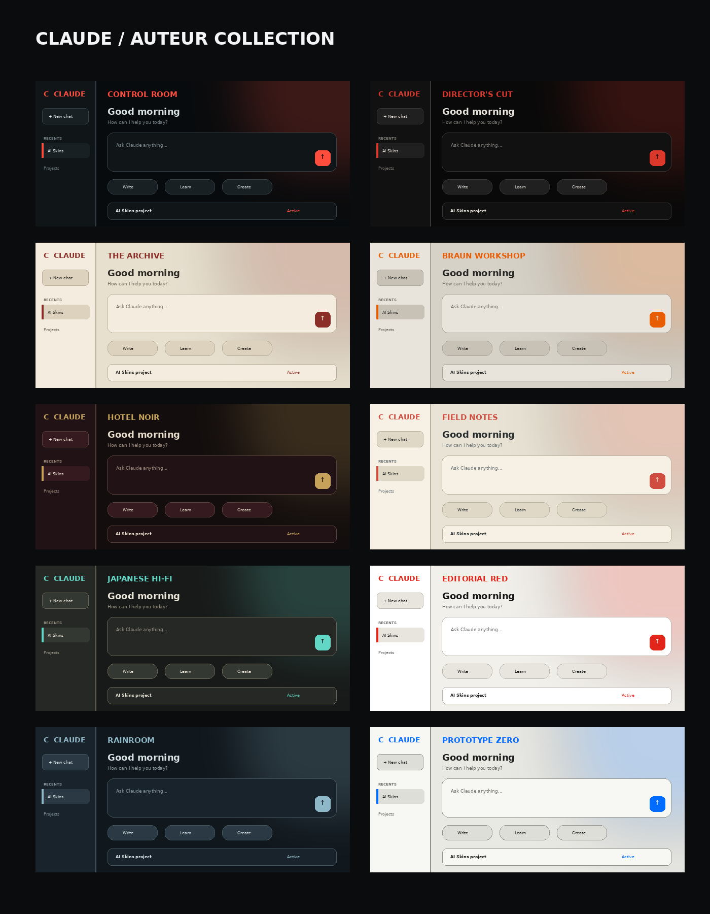

# AI Skins

A Winamp-inspired skin system for ChatGPT, Codex, and Claude. Switch between 30 complete visual identities, from restrained productivity themes to cinematic, industrial, archival and editorial treatments, without changing how the underlying apps work.

> Unofficial community project. Not affiliated with or endorsed by OpenAI or Anthropic. ChatGPT, Codex, and Claude are trademarks of their respective owners.

## What it does

- Applies complete palettes, typography, surfaces, borders, glow and optional texture effects.
- Includes **10 Standard skins**, **10 Signature skins**, and **10 Auteur skins**.
- Adds Compact, Comfortable and Airy interface-density options.
- Adjusts the maximum workspace width for focused or ultrawide layouts.
- Stores every preference locally and makes no network requests.
- Provides a master switch that immediately restores the original interface.
- Uses conservative semantic styling so individual enhancements fail safely when a supported interface changes.

## Install locally

1. Unzip the package.
2. Open `chrome://extensions` in Chrome or `edge://extensions` in Edge.
3. Enable **Developer mode**.
4. Choose **Load unpacked** and select the `ai-skins` folder.
5. Open or refresh `https://chatgpt.com` or `https://claude.ai`, then click the extension icon.

## Included skins: Standard

1. ChatGPT Classic
2. Winamp Industrial
3. Amber Terminal
4. Neon Grid
5. Paper & Ink
6. Blueprint
7. Studio Light
8. Game Dev Desk
9. Midnight OLED
10. Bavarian Workshop

## Included skins: Signature

1. Obsidian Glass
2. Liquid Chrome
3. Sakura After Dark
4. Monolith
5. Ivory Atelier
6. Abyssal
7. Ember Forge
8. Holographic
9. Toxic Executive
10. Celestial

## Included skins: Auteur

1. Control Room
2. Director's Cut
3. The Archive
4. Braun Workshop
5. Hotel Noir
6. Field Notes
7. Japanese Hi-Fi
8. Editorial Red
9. Rainroom
10. Prototype Zero

Each skin can be combined with Compact, Comfortable, or Airy density, a custom workspace width, and adjustable texture intensity.

## Safety and limitations

- The extension runs only on `chatgpt.com` and `claude.ai` and stores preferences locally.
- It requests no browsing-history, network, or account permissions.
- Interface updates can change internal layout selectors. Separate platform adapters rely primarily on semantic CSS variables to reduce breakage and isolate failures.
- Turn the master switch off to immediately restore the original appearance.
- The popup reports whether the extension is connected to the current ChatGPT, Codex, or Claude tab.

## Compatibility policy

The base palette layer uses shared CSS variables. ChatGPT and Claude compatibility rules are isolated by platform. Optional layout adjustments use broad semantic selectors and fail independently. Generated class names are deliberately avoided. Compatibility reports are welcome through the included GitHub issue template.

## Development

Edit `skins.js` to add themes. Every skin supplies its own palette, typography, border radius, and optional glow. Reload the extension from the browser extensions page after changing files.
