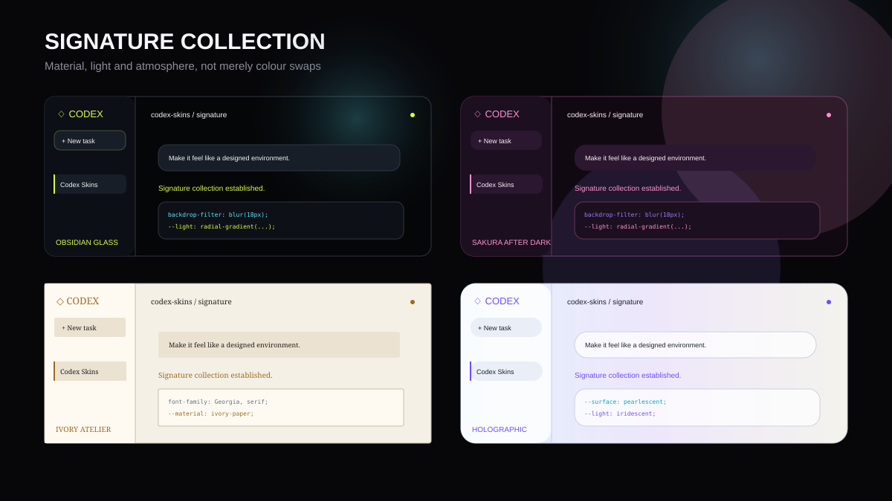
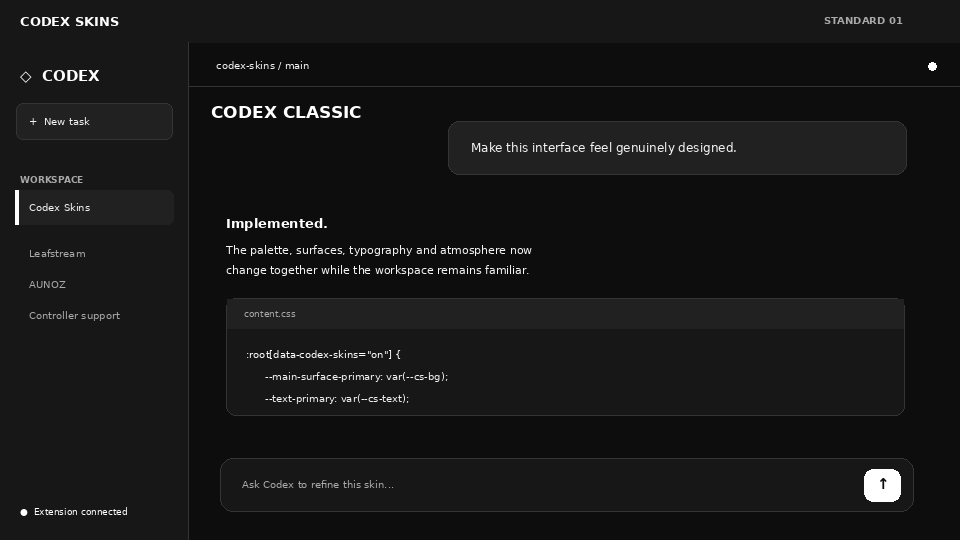

# Codex Skins

A Winamp-inspired skin system for ChatGPT Codex. Switch between 20 complete visual identities, from restrained productivity themes to glass, chrome, neon and editorial treatments, without changing how Codex works.

> Unofficial community project. Not affiliated with or endorsed by OpenAI. ChatGPT and Codex are trademarks of their respective owner.

## What it does

- Applies complete palettes, typography, surfaces, borders, glow and optional texture effects.
- Includes **10 Standard skins** and **10 Signature skins**.
- Adds Compact, Comfortable and Airy interface-density options.
- Adjusts the maximum workspace width for focused or ultrawide layouts.
- Stores every preference locally and makes no network requests.
- Provides a master switch that immediately restores the original interface.
- Uses conservative semantic styling so individual enhancements fail safely when ChatGPT changes.

## Install locally

1. Unzip the package.
2. Open `chrome://extensions` in Chrome or `edge://extensions` in Edge.
3. Enable **Developer mode**.
4. Choose **Load unpacked** and select the `codex-skins` folder.
5. Open or refresh `https://chatgpt.com`, then click the extension icon.

## Included skins: Standard

1. Codex Classic
2. Winamp Industrial
3. Amber Terminal
4. Neon Grid
5. Paper & Ink
6. Blueprint
7. Studio Light
8. Game Dev Desk
9. Midnight OLED
10. Bavarian Workshop

## Included skins: Signature

1. Obsidian Glass
2. Liquid Chrome
3. Sakura After Dark
4. Monolith
5. Ivory Atelier
6. Abyssal
7. Ember Forge
8. Holographic
9. Toxic Executive
10. Celestial

Each skin can be combined with Compact, Comfortable, or Airy density, a custom workspace width, and adjustable texture intensity.

## Safety and limitations

- The extension runs only on `chatgpt.com` and stores preferences locally.
- It requests no browsing-history, network, or account permissions.
- ChatGPT interface updates can change internal layout selectors. The theme relies primarily on semantic CSS variables to reduce breakage.
- Turn the master switch off to immediately restore the original appearance.
- The popup reports whether the extension is connected to the current ChatGPT tab.

## Compatibility policy

The base palette layer uses shared CSS variables. Optional layout adjustments use broad semantic selectors and fail independently. Generated class names are deliberately avoided. Compatibility reports are welcome through the included GitHub issue template.

## Development

Edit `skins.js` to add themes. Every skin supplies its own palette, typography, border radius, and optional glow. Reload the extension from the browser extensions page after changing files.
